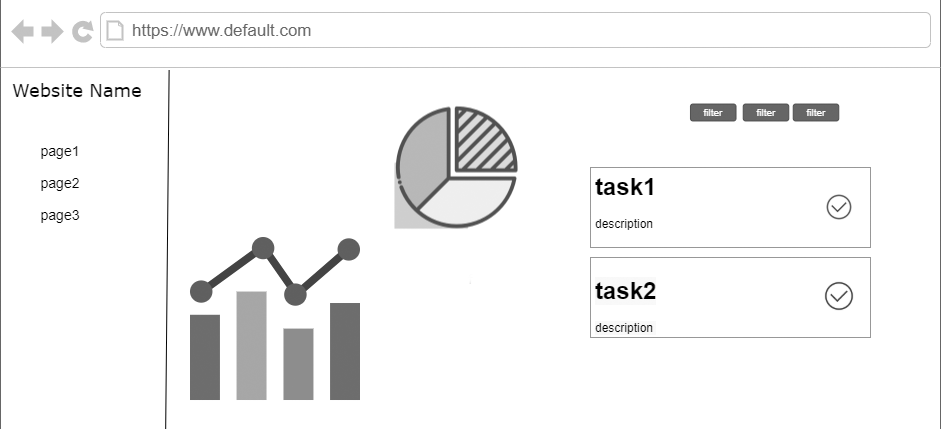
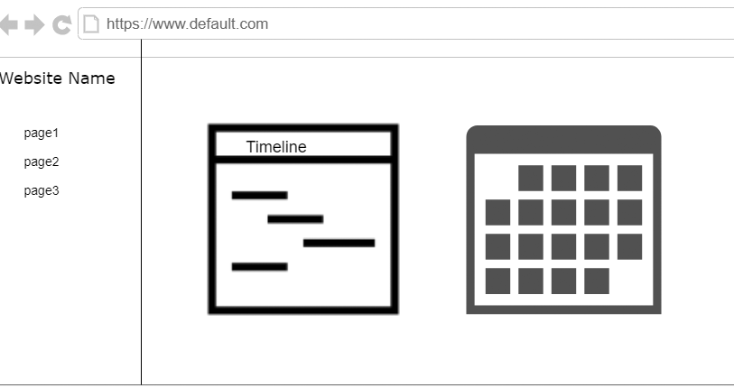
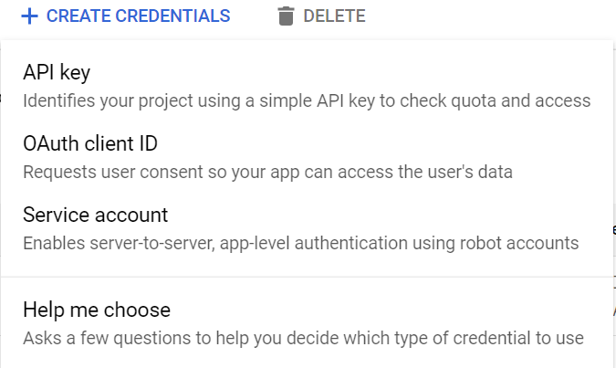
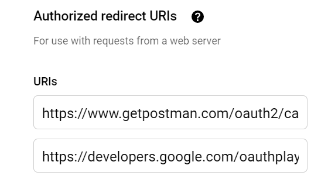
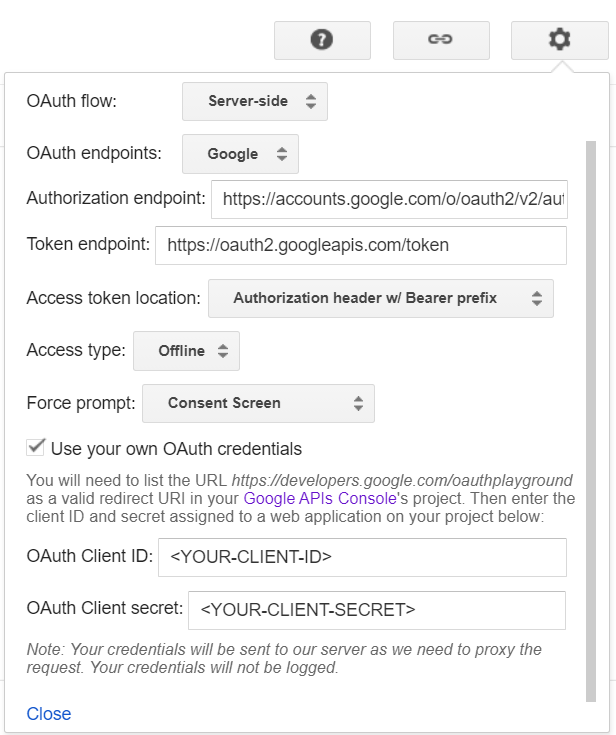
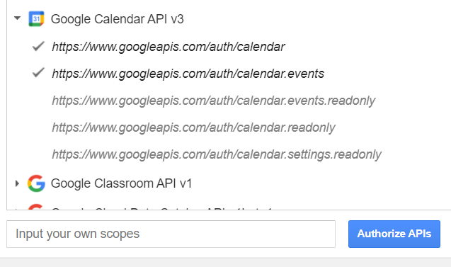
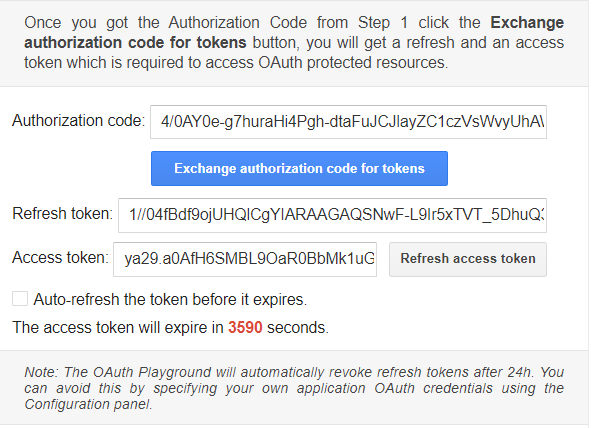
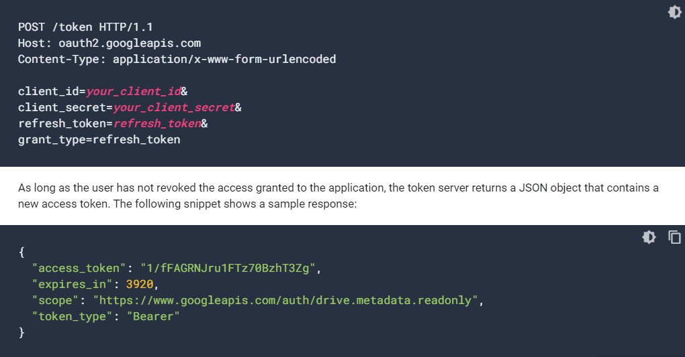
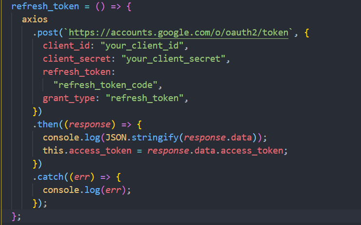

# planner

A basic web to manage your tasks
So you can Follow up on workflow and Distribute tasks to the team

## Getting Started

Access to the [planner](https://pages.git.generalassemb.ly/bushra-mulla/planner./)

## Technologies Used In The Project

- react.js
- Api (google calendar Api)
- Bootstrab
- CSS

## wireframes

## Demo

## User Stories

- As a user, I should be able to add new tasks
- As a user, I should be able to edit tasks
- As a user, I should be able to delete one or all tasks in the project
- As a user, I should be able to Follow up on workflow
- As a user, I should be able to Change the status of tasks

## Project Plan

- Started first by create wireframes
- write the Requirements in the project
- Wrote the process / flow the code
- Created component flow
- After that, I began working on the Api.

## Difficulties Encountered

The difficulties part was in auth2 to get access to the google chalendar Api
Get the key is very easy, but to be able for change (post/put/delete) the Api url not accespt the key it need access token.
get access token is not that easy there are meny steps to do

- From google console api create new project
- requests the client id, and save the Client ID and Client secret for later use.
  
- create Authorized redirect URls to use with requests from a web server (every web server has a Specific Urls so you need to know the server that you will use) in this case

  - Different redirect Url for Different server.
    
    The first one is for postman, Make Authorizing requests and implement access token. (the access token for google api have limeted time (60 min) so the next step is implement access token refresh. in postman it need to do steps more to [git the refresh token](https://developers.google.com/identity/protocols/oauth2/web-server#httprest_7))

        The second one is for google developer OAuth 2.0 Playground (I recommend it).

- In the google developer [OAuth 2.0 Playground](https://developers.google.com/oauthplayground/):
  - in the configuration menu of the playground in the top right, use project OAuth Credentials (Client ID and Client Secret)
    
  - Select the authorize APIs (Select the scope for the APIs Used Then click the "Authorize APIs" button.
    
  - It need allow to access to your google account
  - It make the reqest and implement the access token and the refresh token
    
    The standard OAuth behaviour, configure lifetimes access token and refresh token
    • Access token lasts 60 minutes
    • Refresh token lasts for 12 hours
    But since I use my project Oauth credentials the refresh token will not revoke after the lifetime up.
    But the access token still have short lifetime, so it need to use the refresh token to create a new access token.
    This step is a little confusing in google Oauth2 documentation, the way to do it is Using OAuth 2.0 for Web Server Applications.
    (There are steps to implement refresh token using code but it's a little confuse too, so I recommend using google developer OAuth 2.0 Playground)
  - Refreshing an access token (offline access): Access tokens periodically expire and become invalid credentials for a related API request. You can refresh an access token without prompting the user for permission (including when the user is not present) if you requested offline access to the scopes associated with the token.
    
    

## Future updates to project

- create many project
- create account and make the user able to there tasks.
- share any information aboute project in project page.
- create dashbourd with Portfolios

## ReSources

- https://developers.google.com/calendar/concepts
- https://developers.google.com/identity/protocols/oauth2/web-server#httprest_7
- https://developers.google.com/identity/protocols/oauth2/service-account
- https://developers.google.com/oauthplayground/
